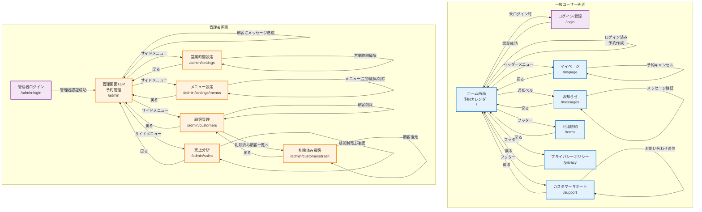
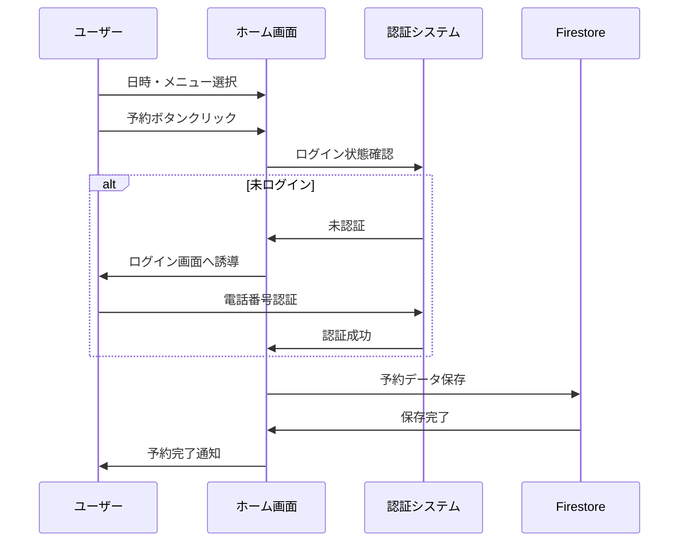
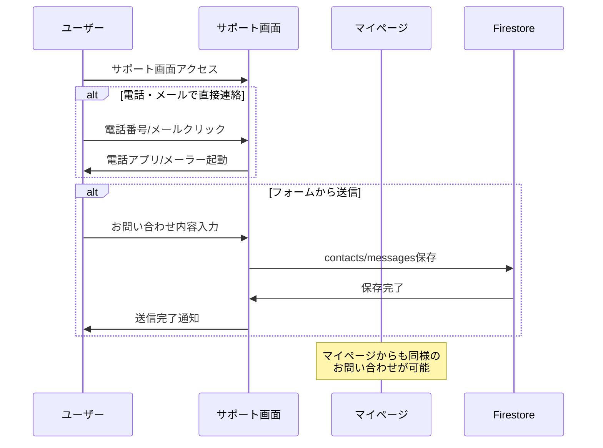
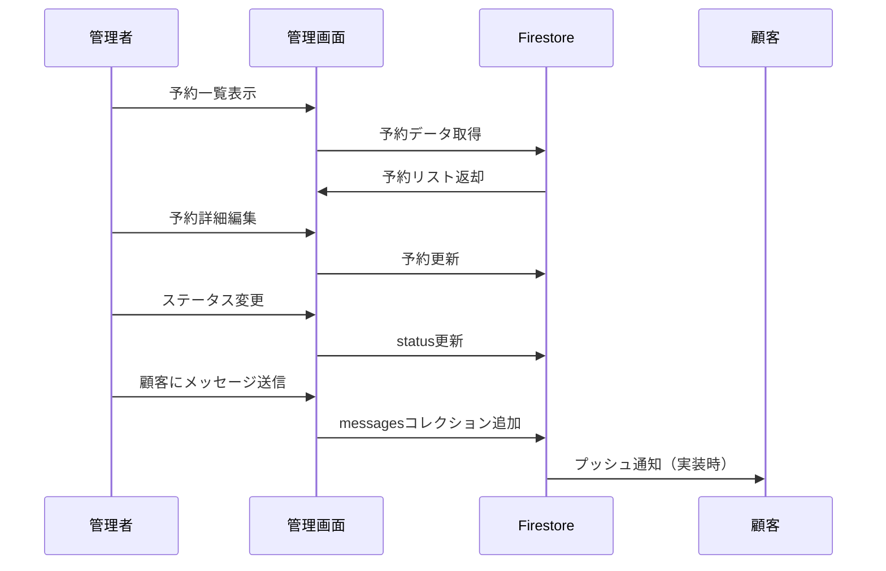

# ヘアーサロン Joy's 予約システム - 画面遷移図

## 全体構成

## 画面一覧

### 一般ユーザー画面

| 画面名 | パス | 説明 | 認証 |
|--------|------|------|------|
| ホーム画面 | `/` | 予約カレンダー、メニュー選択、予約作成 | 不要（予約作成時は必要） |
| ログイン/登録 | `/login` | 電話番号認証によるログイン | 不要 |
| マイページ | `/mypage` | お客様情報編集、予約一覧、お問い合わせフォーム | 必要 |
| お知らせ | `/messages` | 店舗からの通知メッセージ一覧 | 必要 |
| カスタマーサポート | `/support` | お問い合わせフォーム（電話・メール・フォーム送信） | 不要（送信は必要） |
| 利用規約 | `/terms` | サービス利用規約 | 不要 |
| プライバシーポリシー | `/privacy` | 個人情報保護方針 | 不要 |

### 管理者画面

| 画面名 | パス | 説明 | 認証 |
|--------|------|------|------|
| 管理者ログイン | `/admin-login` | 管理者認証 | 不要 |
| 管理画面TOP | `/admin` | 予約一覧、予約管理、メッセージ送信 | 管理者権限必要 |
| 営業時間設定 | `/admin/settings` | 営業時間・定休日の設定 | 管理者権限必要 |
| メニュー設定 | `/admin/settings/menus` | サービスメニューの追加・編集・削除 | 管理者権限必要 |
| 顧客管理 | `/admin/customers` | 顧客情報の閲覧・編集・削除 | 管理者権限必要 |
| 削除済み顧客 | `/admin/customers/trash` | 論理削除された顧客の一覧・復元 | 管理者権限必要 |
| 売上分析 | `/admin/sales` | 期間別売上レポート | 管理者権限必要 |

## 主要な機能フロー

### 1. 予約作成フロー

### 2. お問い合わせフロー

### 3. 管理者：予約管理フロー

## 画面間の依存関係

### 共通コンポーネント

- **AppFooter**: 全画面共通フッター（利用規約、プライバシーポリシー、カスタマーサポートへのリンク）
- **ConfirmDialog**: 確認ダイアログ（予約削除、ログアウト等）
- **ヘッダーナビゲーション**: ログイン状態、お知らせ通知、ハンバーガーメニュー

### 認証ガード

- **一般ユーザー**: マイページ、お知らせ、お問い合わせ送信時にログイン必要
- **管理者**: `/admin` 配下の全画面で管理者権限（Firebaseカスタムクレーム）が必要

## 外部連携

- **Firebase Authentication**: 電話番号認証
- **Firestore**: データ永続化
- **LINE認証**: LINEミニアプリとしての認証連携（実装済み）

## 備考

- LINEミニアプリのセーフエリア対応済み（ノーマルモード: 下34px、ランドスケープ: 左右44px・下21px）
- レスポンシブデザイン対応（PC/タブレット/スマートフォン）
- リアルタイム通知機能（お知らせの未読数をヘッダーに表示）
